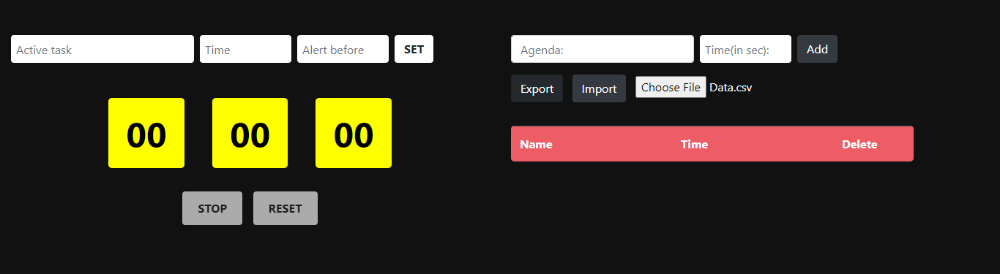
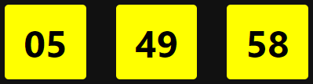
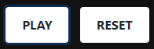
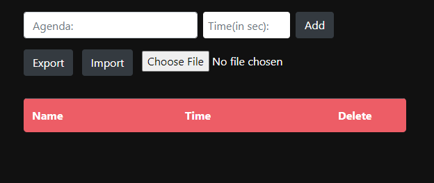
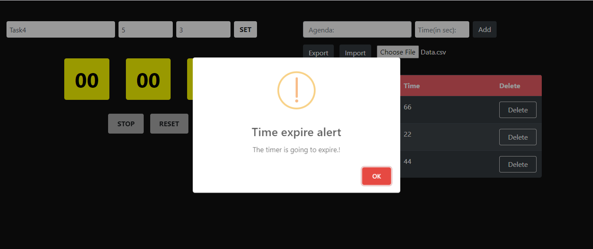
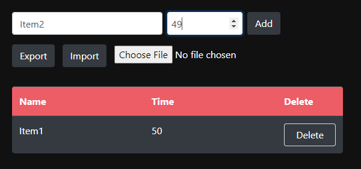
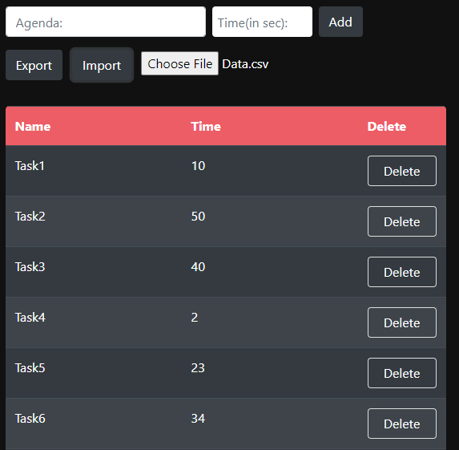
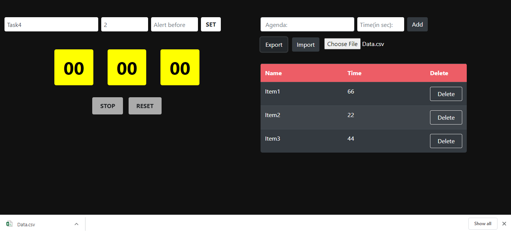
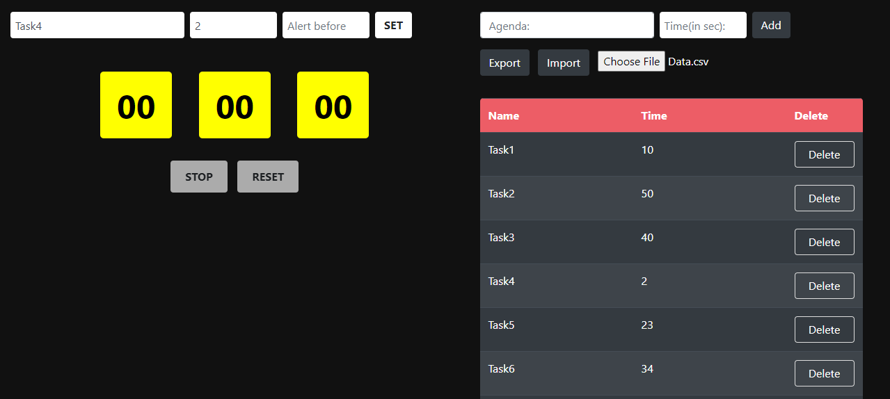

# Web Based Countdown Timer

## Introduction

Using a countdown clock when undertaking a certain project or task will force you to focus on the task at hand. This is because of the fact that it creates a certain sense of urgency about the project or task you are undertaking.

A web based **Countdown Timer** build to provide it's user a complete package to track your tasks. Interactive full-screen countdown timer!

## Features:

- Best daily working tasks.
- Start/ Stop/ Pause ongoing timer.
- Import/ Export using .csv files.
- Notification before time ends.
- Simple UI.

## How to use

- Active task: Add your task name here you want to add.
- Time: Add time in seconds for how long will it run for.
- Alert before: Add time in seconds before which you want to get alert.

## Timer

| hh  | mm  |  ss |
| --- | :-: | --: |

## Control Buttons

- Play: Starting the countdown after you insert all the required perimeters.
- Reset: Reset's all the values.

## Add multiple task to countdown

The user can add more than one tasks to the countdown web app. There is also an option to import .csv/.xls file to insert multiple data.

## Notification

Set notification time in the **Alert before** text box. Add the seconds before you want to have a notification poped up, so you could be notified about your upcoming deadline.

## Adding multiple tasks manually

The tasks could be added manually by just adding task name and time.

## Upload data via .csv/.xls file

The tasks can be uploaded in bulk via the required file format. So the time gets save and you can focus on your ongoing tasks.

## Export Tasks

You can export all your tasks by simply clicking on the export button, it will download Data.csv file containing all of your tasks in it. So you can have a record of all your tasks.

## Select any task and Start

Click any task to select and after it you can start/stop the task. Its that much easy.

# Thank you for using
